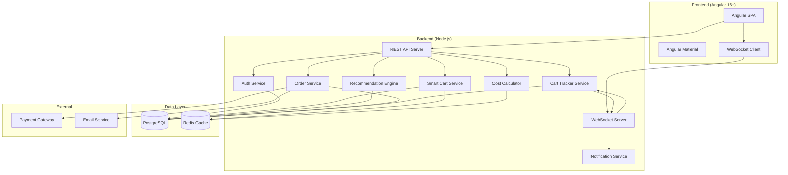
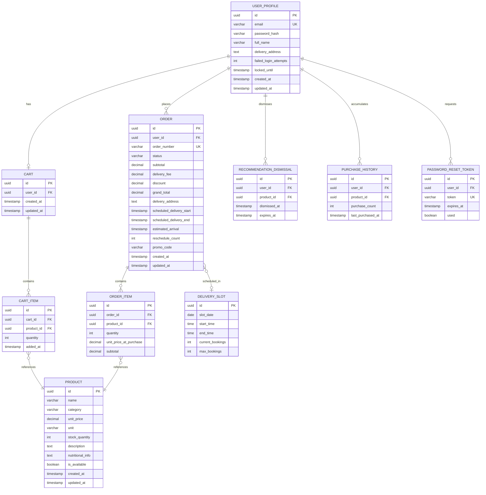

# Design Document

## Overview

Cartelligence is an AI-powered grocery e-commerce platform targeting working professionals in Olongapo City. The system provides intelligent grocery shopping through a smart cart with real-time cost calculation, personalized recommendations, and live order tracking with push notifications.

The platform follows a three-tier architecture: an Angular 16+ single-page application (SPA) frontend, a Node.js RESTful API backend, and a PostgreSQL database. The AI recommendation engine operates as a service within the backend layer, analyzing purchase history to generate personalized suggestions.

Key design decisions:
- **Monorepo structure** with separate `client/` and `server/` directories for clear separation of concerns
- **Angular Material** for UI components, themed to a monochrome (black/white/grayscale) palette
- **JWT-based authentication** with refresh tokens for stateless session management
- **WebSocket connections** for real-time cart tracking and push notifications
- **Collaborative filtering** approach for the recommendation engine, using purchase co-occurrence data

## Architecture



### Architecture Decisions

| Decision | Choice | Rationale |
|----------|--------|-----------|
| Session management | JWT + Refresh Token | Stateless auth scales horizontally; 30-min access token matches inactivity timeout requirement |
| Real-time updates | WebSocket (Socket.IO) | Required for live order tracking (60s ETA updates) and push notifications within 5 seconds |
| Caching | Redis | Sub-500ms cart recalculation requires in-memory caching for cart state and product prices |
| Recommendation approach | Collaborative filtering (item-based) | Purchase co-occurrence is effective for grocery baskets; runs async and caches results |
| API style | RESTful with versioning | Matches requirement 10.2; versioned endpoints allow future evolution |
| Password hashing | bcrypt (cost factor 12) | Exceeds minimum requirement of cost factor 10; industry standard |
| Database encryption | AES-256 at rest, TLS 1.2+ in transit | Matches requirement 10.5 |

## Components and Interfaces

### Frontend Components

#### 1. Auth Module
- **LoginComponent**: Email/password form with validation, account lockout messaging
- **RegisterComponent**: Registration form with real-time field validation
- **PasswordResetComponent**: Reset request and new password form

#### 2. Catalog Module
- **CategoryListComponent**: Displays 7 grocery categories in grid layout
- **ProductListComponent**: Paginated product grid (20 per page) with search
- **ProductDetailComponent**: Individual product view with related recommendations
- **SearchBarComponent**: Debounced search input (min 2 chars, max 100 chars)

#### 3. Cart Module
- **SmartCartComponent**: Main cart view with item list, quantities, and totals
- **CartItemComponent**: Individual item row with quantity controls (1-99)
- **RecommendationPanelComponent**: Displays up to 5 suggested items when cart has 3+ items
- **CostBreakdownComponent**: Subtotal, delivery fee, discount, grand total display

#### 4. Order Module
- **CheckoutComponent**: Order summary, delivery slot selection, payment method
- **PaymentComponent**: Payment form with retry logic (up to 3 attempts)
- **OrderConfirmationComponent**: Success screen with order number
- **DeliverySchedulerComponent**: Time slot picker for next 3 days

#### 5. Tracking Module
- **OrderTrackerComponent**: Real-time order status display
- **OrderListComponent**: Active orders list (up to 20)
- **ETADisplayComponent**: Estimated arrival countdown (updates every 60s)
- **OfflineIndicatorComponent**: Shows last-known status when disconnected

#### 6. Layout Module
- **HeaderComponent**: Navigation, cart icon with item count
- **FooterComponent**: Links, tagline "Click.Cart. Delivered."
- **LandingPageComponent**: Tagline display, login/register CTAs

### Backend API Endpoints

#### Auth API (`/api/v1/auth`)
| Method | Endpoint | Description |
|--------|----------|-------------|
| POST | `/register` | Create new user account |
| POST | `/login` | Authenticate and return JWT |
| POST | `/logout` | Invalidate refresh token |
| POST | `/password-reset/request` | Send reset email |
| POST | `/password-reset/confirm` | Set new password |
| POST | `/token/refresh` | Refresh access token |

#### Products API (`/api/v1/products`)
| Method | Endpoint | Description |
|--------|----------|-------------|
| GET | `/categories` | List all categories |
| GET | `/categories/:id/products` | Products by category (paginated) |
| GET | `/search?q=` | Search products by name |
| GET | `/:id` | Product detail |

#### Cart API (`/api/v1/cart`)
| Method | Endpoint | Description |
|--------|----------|-------------|
| GET | `/` | Get current cart contents |
| POST | `/items` | Add item to cart |
| PATCH | `/items/:id` | Update item quantity |
| DELETE | `/items/:id` | Remove item from cart |

#### Recommendations API (`/api/v1/recommendations`)
| Method | Endpoint | Description |
|--------|----------|-------------|
| GET | `/personalized` | User's personalized recommendations (up to 10) |
| GET | `/cart-based` | Recommendations based on current cart (up to 5) |
| GET | `/product/:id/related` | Related products (up to 5) |
| POST | `/dismiss/:productId` | Dismiss a recommendation for 30 days |

#### Orders API (`/api/v1/orders`)
| Method | Endpoint | Description |
|--------|----------|-------------|
| POST | `/checkout` | Initiate checkout |
| POST | `/confirm` | Confirm and process payment |
| GET | `/` | List user's orders (paginated) |
| GET | `/:id` | Order detail |
| GET | `/active` | Active orders (up to 20) |

#### Delivery API (`/api/v1/delivery`)
| Method | Endpoint | Description |
|--------|----------|-------------|
| GET | `/slots?date=` | Available slots for a date |
| POST | `/orders/:id/reschedule` | Reschedule delivery |

#### Tracking API (WebSocket: `/ws/tracking`)
| Event | Direction | Description |
|-------|-----------|-------------|
| `order:status` | Server→Client | Order status change |
| `order:eta` | Server→Client | Updated ETA (every 60s) |
| `order:delay` | Server→Client | Delay notification (>15 min) |
| `subscribe` | Client→Server | Subscribe to order updates |
| `unsubscribe` | Client→Server | Unsubscribe from order |

### Backend Services

#### AuthService
- `register(dto: RegisterDto): Promise<UserProfile>` — Validates input, hashes password (bcrypt, cost 12), creates user
- `login(dto: LoginDto): Promise<AuthTokens>` — Authenticates, checks lockout, returns JWT pair
- `handleFailedLogin(email: string): Promise<void>` — Increments failure count, locks after 3 failures for 15 min
- `requestPasswordReset(email: string): Promise<void>` — Generates reset token (expires 15 min), sends email
- `confirmPasswordReset(token: string, newPassword: string): Promise<void>` — Validates token, updates password

#### SmartCartService
- `addItem(userId: string, productId: string, quantity: number): Promise<Cart>` — Validates stock, enforces 50-item limit
- `removeItem(userId: string, itemId: string): Promise<Cart>` — Removes item, triggers recalculation
- `updateQuantity(userId: string, itemId: string, quantity: number): Promise<Cart>` — Validates 1-99 range, removes if 0
- `getCart(userId: string): Promise<Cart>` — Returns full cart with calculated totals

#### CostCalculatorService
- `calculateTotal(cart: Cart, promoCode?: string): CostBreakdown` — Computes subtotal, delivery fee, discount, grand total
- `applyDiscount(subtotal: number, deliveryFee: number, discount: number): number` — Returns max(0, subtotal + deliveryFee - discount)
- `formatCurrency(amount: number): string` — Formats to "₱X,XXX.XX"

#### RecommendationService
- `getPersonalized(userId: string): Promise<Product[]>` — Up to 10 items from purchase history analysis
- `getCartBased(cartItems: CartItem[]): Promise<Product[]>` — Up to 5 co-purchased items (requires 3+ cart items)
- `getRelated(productId: string): Promise<Product[]>` — Up to 5 category/correlation-based items
- `getReorderReminders(userId: string): Promise<Product[]>` — Items in 2+ of last 5 orders (requires 3+ orders)
- `dismissRecommendation(userId: string, productId: string): Promise<void>` — Excludes for 30 days
- `getFallback(): Promise<Product[]>` — Top 10 selling products

#### OrderService
- `initiateCheckout(userId: string): Promise<CheckoutSummary>` — Validates non-empty cart, returns summary
- `confirmOrder(userId: string, paymentDto: PaymentDto): Promise<OrderConfirmation>` — Verifies stock, processes payment, sends email
- `getActiveOrders(userId: string): Promise<Order[]>` — Up to 20 active orders

#### DeliveryService
- `getAvailableSlots(date: Date): Promise<TimeSlot[]>` — 2-hour windows, 8AM-9PM PST, max 20 orders/slot
- `reserveSlot(orderId: string, slotId: string): Promise<void>` — 15-minute reservation
- `reschedule(orderId: string, newSlotId: string): Promise<void>` — Max 2 reschedules, 2-hour minimum notice

#### CartTrackerService
- `updateStatus(orderId: string, status: OrderStatus): Promise<void>` — Updates and pushes via WebSocket within 5s
- `calculateETA(orderId: string): Promise<Date | null>` — Returns ETA or null if unavailable
- `handleDelayNotification(orderId: string): Promise<void>` — Notifies if >15 min past ETA

## Data Models

### Entity Relationship Diagram



### Key Data Constraints

| Field | Constraint |
|-------|-----------|
| `USER_PROFILE.email` | Valid email format, unique |
| `USER_PROFILE.password_hash` | bcrypt, cost factor ≥ 10 |
| `USER_PROFILE.full_name` | 1–100 characters |
| `USER_PROFILE.delivery_address` | 10–250 characters |
| `PRODUCT.unit_price` | decimal(10,2), ≥ 0 |
| `PRODUCT.category` | ENUM: produce, dairy, meat, beverages, snacks, household, personal_care |
| `CART_ITEM.quantity` | 1–99 |
| `CART` (items count) | Max 50 distinct items |
| `ORDER.status` | ENUM: confirmed, being_prepared, out_for_delivery, delivered, cancelled |
| `ORDER.grand_total` | 0.00–9,999,999.99 PHP |
| `ORDER.reschedule_count` | 0–2 |
| `DELIVERY_SLOT.max_bookings` | 20 |
| `DELIVERY_SLOT.start_time` | Between 08:00 and 19:00 (2-hour windows until 21:00) |
| All monetary values | decimal(10,2), PHP, round-half-up |

## Correctness Properties

*A property is a characteristic or behavior that should hold true across all valid executions of a system—essentially, a formal statement about what the system should do. Properties serve as the bridge between human-readable specifications and machine-verifiable correctness guarantees.*

### Property 1: Registration Input Validation

*For any* registration input (email, password, full name, delivery address), the validation function SHALL accept the input if and only if: the email matches standard email format, the password is 8–64 characters containing at least one uppercase letter, one lowercase letter, one digit, and one special character, the full name is 1–100 characters, and the delivery address is 10–250 characters. When rejected, the error response SHALL correctly identify all fields that failed validation.

**Validates: Requirements 1.1, 1.7**

### Property 2: Product Query Pagination Cap

*For any* product query (whether by category selection or search text of 2–100 characters), the result set SHALL contain at most 20 products per page, and all returned products SHALL match the query criteria (belong to the selected category or contain the search text in their name).

**Validates: Requirements 2.2, 2.3**

### Property 3: Cart Total Invariant After Mutations

*For any* Smart_Cart state and any mutation (adding an item, removing an item, or changing a quantity to 1–99), the resulting cart total SHALL equal the sum of (unit_price × quantity) for every item remaining in the cart, with each line item rounded to two decimal places using round-half-up.

**Validates: Requirements 3.1, 3.2, 3.3, 5.2**

### Property 4: Subtotal Computation

*For any* set of cart items with unit prices and quantities, the Cost_Calculator subtotal SHALL equal the sum of each (unit_price × quantity) rounded individually to two decimal places using round-half-up, and the result SHALL be constrained to the range 0.00 to 9,999,999.99 PHP.

**Validates: Requirements 5.1**

### Property 5: Grand Total Formula With Floor

*For any* subtotal, delivery fee, and discount values, the grand total SHALL equal max(0, subtotal + delivery_fee - discount), ensuring the grand total never goes below 0.00 PHP.

**Validates: Requirements 5.3, 5.6**

### Property 6: Currency Formatting

*For any* monetary value, the formatted output SHALL be prefixed with "₱" and display exactly two decimal places, representing Philippine Peso.

**Validates: Requirements 2.4, 5.5**

### Property 7: Stock Enforcement on Cart Operations

*For any* product with a known stock quantity, attempting to add a quantity exceeding available stock to the Smart_Cart SHALL be rejected, and the system SHALL report the maximum available quantity. Products with zero stock SHALL not be addable to the cart.

**Validates: Requirements 2.5, 3.6**

### Property 8: Smart Cart Display Completeness

*For any* non-empty Smart_Cart state, the cart display SHALL include for each item: item name, unit price, quantity, and subtotal; and for the cart overall: the running grand total. All monetary values SHALL be formatted to exactly 2 decimal places.

**Validates: Requirements 3.4**

### Property 9: Recommendation Threshold

*For any* Smart_Cart, the Recommendation_Engine SHALL produce cart-based suggestions (up to 5 items) if and only if the cart contains 3 or more distinct items. Carts with fewer than 3 items SHALL receive no cart-based recommendations.

**Validates: Requirements 3.5**

### Property 10: Personalized Recommendations Cap

*For any* user with at least 1 previous order, the Recommendation_Engine SHALL return at most 10 personalized product recommendations derived from the user's purchase history.

**Validates: Requirements 4.1**

### Property 11: Reorder Reminder Algorithm

*For any* user with at least 3 previous orders, the reorder reminders SHALL include only products that appear in at least 2 of the user's last 5 orders, and no product that does not meet this threshold SHALL be included.

**Validates: Requirements 4.2**

### Property 12: Recommendation Dismissal Exclusion

*For any* product dismissed by a user, that product SHALL not appear in the user's personalized recommendations for at least 30 days from the dismissal date. After 30 days, the product MAY reappear.

**Validates: Requirements 4.5**

### Property 13: Delivery Slot Structure

*For any* generated delivery schedule, all time slots SHALL be exactly 2-hour windows with start times between 08:00 and 19:00 Philippine Standard Time (producing slots ending no later than 21:00), and no slot SHALL have more than 20 bookings.

**Validates: Requirements 9.3**

### Property 14: Delivery Slot Availability Window

*For any* checkout request, the system SHALL return available delivery slots spanning exactly 3 calendar days starting from the current day, and only slots with fewer than 20 current bookings SHALL be offered.

**Validates: Requirements 9.1**

### Property 15: Reschedule Constraints

*For any* reschedule request, the system SHALL allow the reschedule if and only if: the request is made at least 2 hours before the currently scheduled delivery time AND the order's reschedule count is less than 2. Requests failing either condition SHALL be rejected.

**Validates: Requirements 9.5, 9.6**

### Property 16: Stock Verification at Checkout

*For any* order confirmation attempt, the system SHALL verify that every item in the Smart_Cart has sufficient stock at the time of confirmation. If any item's requested quantity exceeds current stock, the order SHALL be rejected and the unavailable items SHALL be identified.

**Validates: Requirements 7.7**

### Property 17: Write Request Validation

*For any* write request to the backend API, the system SHALL validate all required fields and data types against the defined schema before persisting. Invalid requests SHALL be rejected with an error response identifying which fields failed validation, and no data SHALL be persisted for rejected requests.

**Validates: Requirements 10.8**

## Error Handling

### Error Categories and Responses

| Category | HTTP Status | Behavior |
|----------|-------------|----------|
| Validation Error | 400 | Return field-level error details |
| Authentication Failure | 401 | Clear session, redirect to login |
| Authorization Error | 403 | Display access denied message |
| Resource Not Found | 404 | Display "not found" with navigation options |
| Stock Conflict | 409 | Display available quantity, suggest update |
| Rate Limit (account lockout) | 429 | Display lockout duration, suggest reset |
| Payment Failure | 402 | Display reason, retain cart, allow retry |
| Server Error | 500 | Display generic error, log details server-side |
| Service Unavailable | 503 | Display degraded mode message, retry logic |

### Graceful Degradation Strategy

| Component Failure | User Experience |
|-------------------|-----------------|
| Recommendation Engine down | Cart operations continue; "Recommendations unavailable" message shown |
| WebSocket disconnected | Last known order status displayed with "last updated X ago" indicator |
| Payment gateway timeout | Cart preserved; user can retry up to 3 times |
| Database unavailable | Error response within 5 seconds after 3 retries (2s intervals) |
| ETA calculation fails | "Estimate temporarily unavailable" message; retry every 60 seconds |

### Input Validation Rules

All user inputs are validated at both frontend (Angular reactive forms) and backend (schema validation middleware):

- **Email**: RFC 5322 format validation
- **Password**: 8–64 chars, ≥1 uppercase, ≥1 lowercase, ≥1 digit, ≥1 special character
- **Full name**: 1–100 characters, trimmed
- **Delivery address**: 10–250 characters
- **Search query**: 2–100 characters
- **Cart quantity**: Integer, 1–99
- **Promo code**: Alphanumeric, max 20 characters

### Security Error Handling

- Failed login attempts tracked per account (3 consecutive = 15-minute lockout)
- Password reset tokens expire after 15 minutes, single-use
- JWT access tokens expire after 30 minutes of inactivity
- All error messages avoid leaking internal system details

## Testing Strategy

### Testing Approach

The testing strategy uses a dual approach combining property-based tests for universal correctness guarantees with example-based unit tests for specific scenarios and edge cases.

### Property-Based Testing

**Library**: [fast-check](https://github.com/dubzzz/fast-check) (TypeScript/JavaScript PBT library)

**Configuration**:
- Minimum 100 iterations per property test
- Each test tagged with: `Feature: cartelligence-grocery-app, Property {number}: {property_text}`

**Properties to implement** (from Correctness Properties section):
1. Registration input validation (Property 1)
2. Product query pagination cap (Property 2)
3. Cart total invariant after mutations (Property 3)
4. Subtotal computation (Property 4)
5. Grand total formula with floor (Property 5)
6. Currency formatting (Property 6)
7. Stock enforcement on cart operations (Property 7)
8. Smart Cart display completeness (Property 8)
9. Recommendation threshold (Property 9)
10. Personalized recommendations cap (Property 10)
11. Reorder reminder algorithm (Property 11)
12. Recommendation dismissal exclusion (Property 12)
13. Delivery slot structure (Property 13)
14. Delivery slot availability window (Property 14)
15. Reschedule constraints (Property 15)
16. Stock verification at checkout (Property 16)
17. Write request validation (Property 17)

### Unit Tests (Example-Based)

**Framework**: Jest (backend), Karma + Jasmine (Angular frontend)

**Coverage areas**:
- Login flow (valid/invalid credentials)
- Account lockout at exactly 3 failures
- Password reset token generation and expiry
- Empty cart checkout prevention
- Cart at 50-item limit (boundary)
- Quantity set to 0 or negative (removal)
- Empty search/category results
- Payment failure retry flow (up to 3 attempts)
- Slot reservation expiry (15 minutes)
- Fallback recommendations for new users
- Recommendation engine unavailability handling
- Database retry behavior (3 retries, 2s intervals)

### Integration Tests

**Areas**:
- WebSocket order status updates (within 5 seconds)
- ETA updates every 60 seconds during delivery
- Delay notification when >15 minutes past ETA
- Payment gateway integration
- Email confirmation delivery (within 60 seconds)
- Database query performance (<200ms under load)
- Page load performance (<2 seconds on 4G)

### End-to-End Tests

**Framework**: Cypress or Playwright

**Critical flows**:
- Registration → Login → Browse → Add to Cart → Checkout → Track Order
- Search → Add items → Apply promo → Checkout
- Responsive layout at all breakpoints (320px, 768px, 1024px, 1920px)

### Accessibility Testing

- Automated contrast ratio checks (4.5:1 normal text, 3:1 large text)
- Screen reader compatibility for all interactive elements
- Keyboard navigation for all flows


## Correctness Properties

*A property is a characteristic or behavior that should hold true across all valid executions of a system—essentially, a formal statement about what the system should do. Properties serve as the bridge between human-readable specifications and machine-verifiable correctness guarantees.*

### Property 1: Registration validation correctness

*For any* registration payload, the Platform SHALL accept it if and only if the email matches standard email format, the password is 8–64 characters containing at least one uppercase letter, one lowercase letter, one digit, and one special character, the full name is 1–100 characters, and the delivery address is 10–250 characters. Invalid payloads SHALL be rejected with error messages identifying exactly which fields failed validation.

**Validates: Requirements 1.1, 1.7**

### Property 2: Category filtering and pagination

*For any* product catalog and category selection, the returned product list SHALL contain only products belonging to the selected category, SHALL contain at most 20 products per page, and SHALL only include products where `is_available` is true.

**Validates: Requirements 2.2**

### Property 3: Search results correctness

*For any* search query between 2 and 100 characters and any product catalog, all returned products SHALL have a name containing the query text (case-insensitive), and the result set SHALL contain at most 20 products.

**Validates: Requirements 2.3**

### Property 4: Currency formatting invariant

*For any* monetary value displayed by the Platform, the formatted output SHALL use the "₱" prefix followed by the numeric value with exactly 2 decimal places.

**Validates: Requirements 2.4, 3.4, 5.5**

### Property 5: Out-of-stock cart prevention

*For any* product with `stock_quantity` equal to 0, attempting to add that product to the Smart_Cart SHALL be rejected and the cart contents SHALL remain unchanged.

**Validates: Requirements 2.5**

### Property 6: Cart total calculation invariant

*For any* sequence of cart operations (add, remove, quantity change) on any set of products, the cart subtotal SHALL always equal the sum of `round_half_up(unit_price × quantity, 2)` for each item in the cart, and the result SHALL be within the range 0.00 to 9,999,999.99 PHP.

**Validates: Requirements 3.1, 3.2, 3.3, 5.1, 5.2**

### Property 7: Grand total formula invariant

*For any* cart state with any combination of subtotal, delivery fee, and discount, the grand total SHALL equal `max(0, subtotal + delivery_fee - discount)`, ensuring the grand total never goes below 0.00.

**Validates: Requirements 5.3, 5.4, 5.6**

### Property 8: Recommendation count bounds

*For any* Smart_Cart containing 3 or more items, the Recommendation_Engine SHALL return between 0 and 5 suggested items (inclusive). *For any* product detail page, the related products list SHALL contain between 0 and 5 items (inclusive).

**Validates: Requirements 3.5, 4.3**

### Property 9: Personalized recommendation cap

*For any* user with at least 1 previous order, the Recommendation_Engine SHALL generate a personalized product list containing between 0 and 10 items (inclusive).

**Validates: Requirements 4.1**

### Property 10: Reorder identification correctness

*For any* user with at least 3 previous orders, the reorder suggestion list SHALL contain only products that appear in at least 2 of the user's last 5 orders, and no product meeting this criterion SHALL be excluded (unless dismissed).

**Validates: Requirements 4.2**

### Property 11: Dismissed recommendation exclusion

*For any* product dismissed by a user, that product SHALL not appear in the user's recommendation list for at least 30 days from the dismissal timestamp.

**Validates: Requirements 4.5**

### Property 12: Active orders pagination

*For any* user's active order list query, the result SHALL contain at most 20 orders, and all returned orders SHALL have a status other than "delivered".

**Validates: Requirements 6.4**

### Property 13: Stock verification at checkout

*For any* order confirmation attempt, if any item in the Smart_Cart has a requested quantity exceeding the current `stock_quantity` for that product, the order SHALL be rejected and the user SHALL be notified of the unavailable items.

**Validates: Requirements 7.7**

### Property 14: Delivery slot generation rules

*For any* generated delivery schedule, all time slots SHALL be exactly 2-hour windows falling within 08:00–21:00 PST, slots SHALL be available for exactly the next 3 calendar days from the current date, and each slot SHALL have a maximum capacity of 20 orders.

**Validates: Requirements 9.1, 9.3**

### Property 15: Reschedule rule enforcement

*For any* order reschedule request, the request SHALL be accepted if and only if the order's current `reschedule_count` is less than 2 AND the request is made at least 2 hours before the scheduled delivery time.

**Validates: Requirements 9.5**

### Property 16: Write request schema validation

*For any* write request received by the backend API, the Platform SHALL validate all required fields and data types against the defined schema before persisting, and SHALL reject invalid requests with an error response identifying which fields failed validation.

**Validates: Requirements 10.8**

## Error Handling

### Error Categories

| Category | HTTP Status | Description |
|----------|-------------|-------------|
| Validation Error | 400 | Invalid input data (registration, cart operations, search queries) |
| Authentication Error | 401 | Invalid credentials, expired session |
| Authorization Error | 403 | Account locked, insufficient permissions |
| Not Found | 404 | Product, order, or resource not found |
| Conflict | 409 | Duplicate email, stock unavailable, slot fully booked |
| Rate Limit | 429 | Too many failed login attempts |
| Server Error | 500 | Unexpected internal failures |
| Service Unavailable | 503 | Database unavailable, external service down |

### Error Response Format

```json
{
  "error": {
    "code": "VALIDATION_ERROR",
    "message": "Registration failed due to invalid fields",
    "details": [
      { "field": "password", "reason": "Must contain at least one special character" },
      { "field": "delivery_address", "reason": "Must be between 10 and 250 characters" }
    ],
    "timestamp": "2024-01-15T10:30:00Z"
  }
}
```

### Service-Specific Error Handling

#### Authentication Service
- **Failed login (< 3 attempts):** Return 401 with generic "Invalid credentials" message (no field-specific hints to prevent enumeration)
- **Account locked:** Return 403 with lockout duration remaining; send email notification
- **Password reset for non-existent email:** Return 200 (no indication of email existence to prevent enumeration)

#### Smart Cart Service
- **Stock exceeded:** Return 409 with `max_available_quantity` in response body
- **Cart full (50 items):** Return 409 with message indicating maximum distinct items reached
- **Invalid quantity (≤ 0):** Treat as removal operation, return updated cart state
- **Recommendation Engine unavailable:** Return cart data normally with `recommendations: null` and `recommendations_status: "unavailable"`

#### Cost Calculator Service
- **Overflow (> 9,999,999.99):** Return 400 with message indicating maximum cart value exceeded
- **Invalid promo code:** Return 404 with message indicating code is invalid or expired
- **Discount > total:** Set grand total to 0.00 (not an error condition)

#### Order Service
- **Empty cart checkout:** Return 400 with message indicating cart is empty
- **Payment failure:** Return 402 with failure reason; retain cart; track retry count (max 3)
- **Stock changed during checkout:** Return 409 with list of unavailable items and current stock levels
- **Slot no longer available:** Return 409 with next available slot suggestion

#### Delivery Scheduling
- **All slots booked:** Return 200 with empty slots array and `next_available_date` field
- **Reschedule window passed:** Return 400 with message indicating minimum 2-hour advance notice required
- **Max reschedules reached:** Return 400 with message indicating maximum of 2 reschedules per order

#### Cart Tracker (WebSocket)
- **Connection lost:** Client displays last known status with staleness indicator (time since last update)
- **ETA unavailable:** Send `eta_status: "unavailable"` event; client displays unavailability message; server retries every 60 seconds
- **Reconnection:** Client automatically reconnects with exponential backoff (1s, 2s, 4s, max 30s)

#### Database Failures
- **Connection lost:** Retry up to 3 times with 2-second intervals; if all retries fail, return 503 with "Service temporarily unavailable" message
- **Query timeout:** Return 503 after 5-second threshold; log for monitoring

### Graceful Degradation Strategy

| Component Failure | User Impact | Fallback Behavior |
|-------------------|-------------|-------------------|
| Recommendation Engine | No personalized suggestions | Show top-selling products or "recommendations unavailable" message |
| Payment Gateway | Cannot complete checkout | Retain cart, show error, allow retry |
| Email Service | No confirmation email | Order proceeds; email queued for retry |
| WebSocket | No real-time updates | Polling fallback every 30 seconds |
| Database (read) | Cannot load data | Return cached data if available, else 503 |
| Database (write) | Cannot persist changes | Return 503, no partial writes |

## Testing Strategy

### Testing Approach

The testing strategy employs a dual approach combining property-based tests for universal correctness guarantees with example-based unit tests for specific scenarios and edge cases.

### Property-Based Testing

**Library:** [fast-check](https://github.com/dubzzz/fast-check) (TypeScript/JavaScript PBT library)

**Configuration:**
- Minimum 100 iterations per property test
- Each test tagged with: `Feature: cartelligence-grocery-app, Property {number}: {property_text}`

**Properties to implement:**

| Property | Target Module | Key Generators |
|----------|--------------|----------------|
| 1: Registration validation | Auth Service | Random emails, passwords, names, addresses |
| 2: Category filtering | Product Catalog | Random product lists, category selections |
| 3: Search correctness | Product Catalog | Random product names, search queries (2-100 chars) |
| 4: Currency formatting | Shared utilities | Random decimal numbers |
| 5: Out-of-stock prevention | Smart Cart | Random products with stock=0 |
| 6: Cart total invariant | Cost Calculator | Random cart operations (add/remove/modify sequences) |
| 7: Grand total formula | Cost Calculator | Random subtotals, fees, discounts |
| 8: Recommendation bounds | Recommendation Engine | Random carts with 3+ items, random products |
| 9: Personalized rec cap | Recommendation Engine | Random user profiles with order history |
| 10: Reorder identification | Recommendation Engine | Random order histories (3+ orders) |
| 11: Dismissed exclusion | Recommendation Engine | Random dismissals with timestamps |
| 12: Active orders pagination | Order Service | Random order lists with mixed statuses |
| 13: Stock verification | Order Service | Random carts and stock levels |
| 14: Delivery slot generation | Delivery Scheduler | Random dates |
| 15: Reschedule enforcement | Delivery Scheduler | Random orders with reschedule counts and times |
| 16: Write validation | API middleware | Random payloads with invalid fields |

### Unit Tests (Example-Based)

**Framework:** Jest

**Coverage targets:**
- Auth flow: login success/failure, session expiry, account lockout at exactly 3 attempts
- Cart edge cases: add 51st item (rejected), quantity set to 0 (removal), stock exceeded
- Cost edge cases: discount > total (grand total = 0.00), empty cart (all zeros)
- Checkout: empty cart rejection, payment retry (max 3)
- Delivery: slot reservation expiry (15 min), reschedule < 2 hours (rejected), all slots booked
- Recommendations: engine unavailable fallback, new user (no history) fallback
- Database: connection retry behavior (3 attempts, 2s interval)

### Integration Tests

**Scope:**
- REST API endpoint contracts (request/response validation)
- Database query performance under load (< 200ms for indexed queries)
- WebSocket event delivery for order status changes
- Payment gateway integration (mock in CI, sandbox in staging)
- Email service delivery (mock SMTP in CI)

### End-to-End Tests

**Framework:** Cypress or Playwright

**Key flows:**
- Complete registration → login → browse → add to cart → checkout → track order
- Responsive layout verification at breakpoints (320px, 768px, 1024px, 1920px)
- Monochrome theme compliance (no non-functional color usage)
- Accessibility: contrast ratio verification (4.5:1 normal text, 3:1 large text)

### Performance Tests

- Page load: above-the-fold content < 2 seconds on simulated 4G
- API response times under 1000 concurrent users
- WebSocket notification delivery < 5 seconds
- Cart operation response < 500ms

### Test Environment

- **CI:** GitHub Actions with PostgreSQL service container
- **Mocks:** Payment gateway, email service, recommendation engine (for isolation)
- **Seed data:** Scripted product catalog with all 7 categories, sample users with order history
