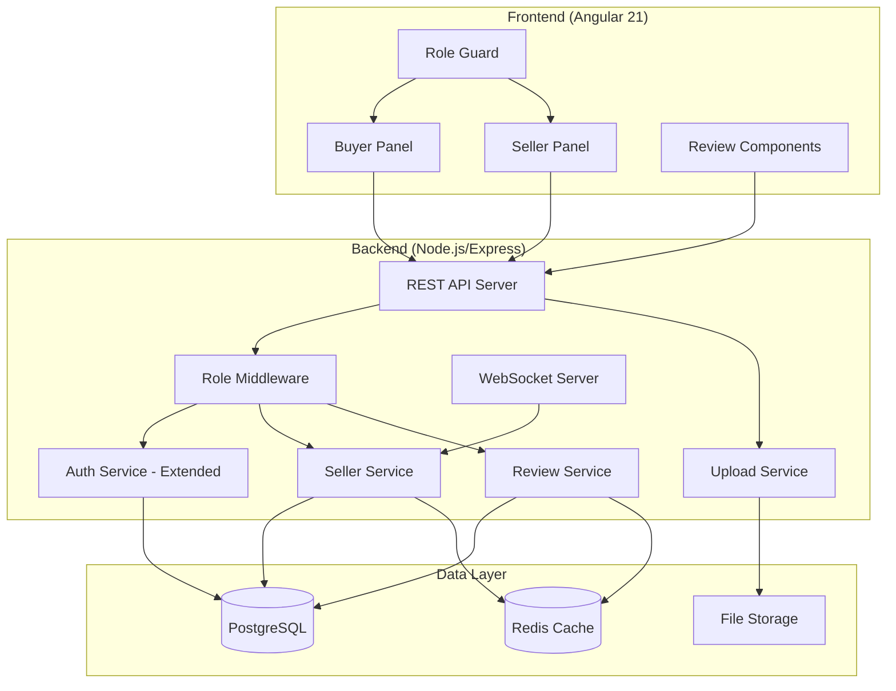
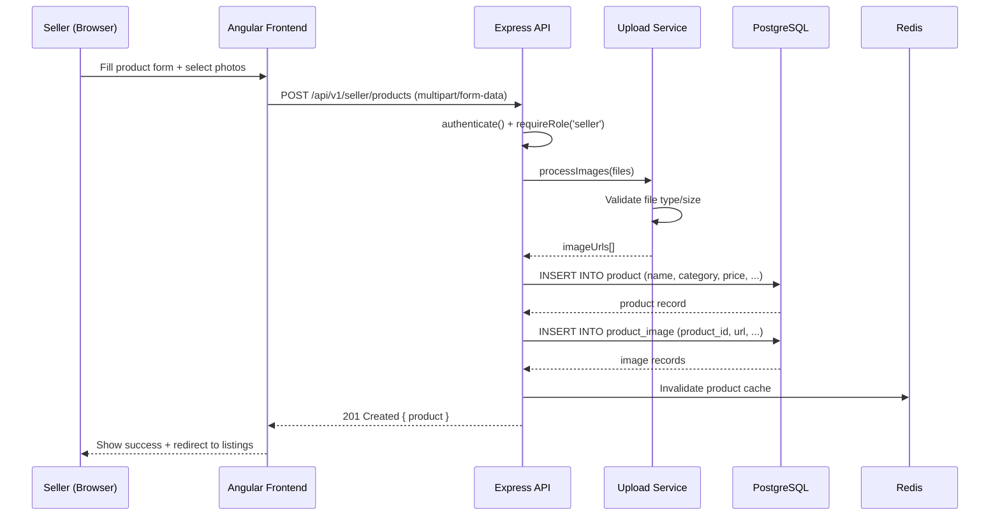
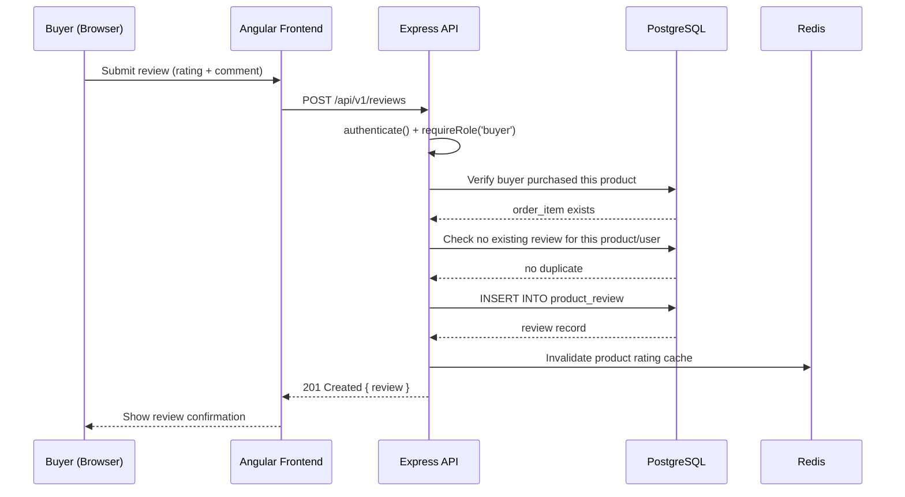
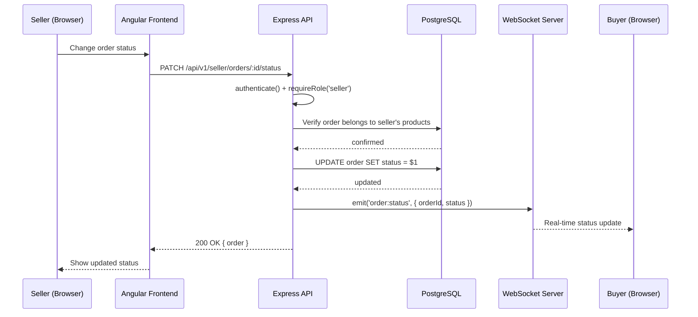
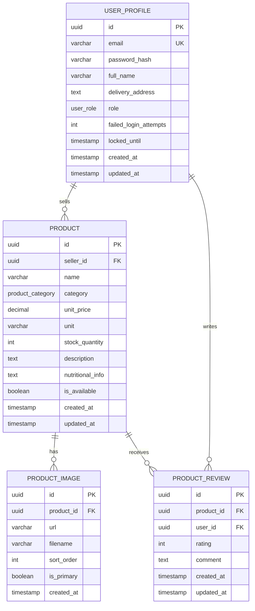

# Design Document: Seller & Buyer Panels

## Overview

This feature introduces role-based access control to the Cartelligence platform, splitting the existing single-user experience into distinct Seller and Buyer panels. Sellers gain a dedicated dashboard to manage product listings (upload photos, set descriptions, categories, quantities, and prices), view incoming orders, and update order statuses. Buyers gain the ability to leave product reviews (star rating + text comment) on purchased items.

The design extends the existing `user_profile` table with a `role` column, adds new database tables for product images and reviews, introduces role-based route guards on both frontend and backend, and creates new Angular modules for the seller dashboard. The existing buyer flows (browse, cart, checkout, tracking) remain intact with minimal modification.

Key design decisions:
- **Role column on user_profile** rather than a separate roles table — the system only needs two roles (seller/buyer) with no multi-role support
- **Multer + local disk storage** for product image uploads with a future path to S3/cloud storage
- **Seller-specific JWT claims** — the `role` field is embedded in the JWT payload for frontend route guarding without extra API calls
- **Separate Angular lazy-loaded module** for the seller panel to keep bundle size minimal for buyers

## Architecture



### Sequence Diagram: Seller Product Upload



### Sequence Diagram: Buyer Submits Review



### Sequence Diagram: Seller Updates Order Status



## Components and Interfaces

### Frontend Components — Seller Panel

#### SellerDashboardComponent
**Purpose**: Main landing page for sellers showing key metrics (total products, pending orders, recent activity)

**Responsibilities**:
- Display product count, active order count, revenue summary
- Quick navigation to product management and order management

#### ProductManagementComponent
**Purpose**: CRUD interface for managing product listings

**Responsibilities**:
- Display paginated list of seller's products with status indicators
- Provide actions: create, edit, delete, toggle availability
- Show stock levels and pricing at a glance

#### ProductFormComponent
**Purpose**: Create/edit product form with image upload

**Responsibilities**:
- Reactive form with fields: name, description, category, price, unit, quantity
- Multi-image upload with drag-and-drop and preview
- Image reordering (primary image selection)
- Form validation with real-time feedback

#### SellerOrderListComponent
**Purpose**: Display orders containing the seller's products

**Responsibilities**:
- Paginated list of orders with buyer info, items, totals
- Filter by status (confirmed, being_prepared, out_for_delivery, delivered)
- Status update controls per order

#### SellerOrderDetailComponent
**Purpose**: Detailed view of a single order for the seller

**Responsibilities**:
- Show all items in the order that belong to this seller
- Display buyer delivery address and time slot
- Provide status transition buttons with confirmation

### Frontend Components — Buyer Panel (New)

#### ProductReviewFormComponent
**Purpose**: Form for submitting a product review

**Responsibilities**:
- Star rating input (1-5 stars)
- Text comment input (10-500 characters)
- Submit only if buyer has purchased the product
- Prevent duplicate reviews

#### ProductReviewListComponent
**Purpose**: Display reviews for a product

**Responsibilities**:
- Paginated list of reviews with star ratings, comments, dates
- Average rating display with star visualization
- Sort by date (newest first) or rating

### Backend API Endpoints — Seller

#### Seller Products API (`/api/v1/seller/products`)
| Method | Endpoint | Description |
|--------|----------|-------------|
| GET | `/` | List seller's products (paginated) |
| GET | `/:id` | Get seller's product detail |
| POST | `/` | Create new product (multipart) |
| PUT | `/:id` | Update product details |
| DELETE | `/:id` | Soft-delete product |
| PATCH | `/:id/availability` | Toggle product availability |

#### Seller Orders API (`/api/v1/seller/orders`)
| Method | Endpoint | Description |
|--------|----------|-------------|
| GET | `/` | List orders for seller's products (paginated) |
| GET | `/:id` | Get order detail |
| PATCH | `/:id/status` | Update order status |

### Backend API Endpoints — Reviews

#### Reviews API (`/api/v1/reviews`)
| Method | Endpoint | Description |
|--------|----------|-------------|
| POST | `/` | Submit a product review |
| GET | `/product/:productId` | Get reviews for a product (paginated) |
| GET | `/product/:productId/summary` | Get average rating and count |
| DELETE | `/:id` | Delete own review |


## Data Models

### Entity Relationship Diagram (New/Modified Tables)



### New Enum Type

```sql
CREATE TYPE user_role AS ENUM ('buyer', 'seller');
```

### Schema Changes

#### Modified: `user_profile` table
```sql
ALTER TABLE user_profile ADD COLUMN role user_role NOT NULL DEFAULT 'buyer';
```

#### Modified: `product` table
```sql
ALTER TABLE product ADD COLUMN seller_id UUID REFERENCES user_profile(id) ON DELETE CASCADE;
CREATE INDEX idx_product_seller ON product (seller_id);
```

#### New: `product_image` table
```sql
CREATE TABLE product_image (
  id UUID PRIMARY KEY DEFAULT uuid_generate_v4(),
  product_id UUID NOT NULL REFERENCES product(id) ON DELETE CASCADE,
  url VARCHAR(500) NOT NULL,
  filename VARCHAR(255) NOT NULL,
  sort_order INTEGER NOT NULL DEFAULT 0,
  is_primary BOOLEAN NOT NULL DEFAULT FALSE,
  created_at TIMESTAMP WITH TIME ZONE NOT NULL DEFAULT NOW(),

  CONSTRAINT product_image_sort_order_non_negative CHECK (sort_order >= 0)
);

CREATE INDEX idx_product_image_product ON product_image (product_id, sort_order);
```

#### New: `product_review` table
```sql
CREATE TABLE product_review (
  id UUID PRIMARY KEY DEFAULT uuid_generate_v4(),
  product_id UUID NOT NULL REFERENCES product(id) ON DELETE CASCADE,
  user_id UUID NOT NULL REFERENCES user_profile(id) ON DELETE CASCADE,
  rating INTEGER NOT NULL,
  comment TEXT NOT NULL,
  created_at TIMESTAMP WITH TIME ZONE NOT NULL DEFAULT NOW(),
  updated_at TIMESTAMP WITH TIME ZONE NOT NULL DEFAULT NOW(),

  CONSTRAINT product_review_rating_range CHECK (rating BETWEEN 1 AND 5),
  CONSTRAINT product_review_comment_length CHECK (char_length(comment) BETWEEN 10 AND 500),
  CONSTRAINT product_review_unique_per_user UNIQUE (product_id, user_id)
);

CREATE INDEX idx_product_review_product ON product_review (product_id, created_at DESC);
CREATE INDEX idx_product_review_user ON product_review (user_id);
```

### Key Data Constraints

| Field | Constraint |
|-------|-----------|
| `USER_PROFILE.role` | ENUM: buyer, seller (default: buyer) |
| `PRODUCT.seller_id` | FK to user_profile, NOT NULL for seller-created products |
| `PRODUCT_IMAGE.url` | VARCHAR(500), NOT NULL |
| `PRODUCT_IMAGE.sort_order` | INTEGER >= 0 |
| `PRODUCT_REVIEW.rating` | INTEGER 1–5 |
| `PRODUCT_REVIEW.comment` | TEXT 10–500 characters |
| `PRODUCT_REVIEW` (unique) | One review per user per product |
| Product images per product | Max 5 images |
| Image file size | Max 5MB per image |
| Image formats | JPEG, PNG, WebP only |


## Key Functions with Formal Specifications

### Function 1: requireRole() Middleware

```typescript
function requireRole(...roles: UserRole[]): RequestHandler
```

**Preconditions:**
- `req.user` is populated (authenticate middleware ran first)
- `req.user.role` is a valid `UserRole` enum value
- `roles` array is non-empty

**Postconditions:**
- If `req.user.role` is in `roles`: calls `next()`, request proceeds
- If `req.user.role` is NOT in `roles`: throws AppError(403, 'Insufficient permissions')
- No side effects on request or database

### Function 2: SellerService.createProduct()

```typescript
async createProduct(
  sellerId: string,
  dto: CreateProductDto,
  images: UploadedFile[]
): Promise<Product>
```

**Preconditions:**
- `sellerId` corresponds to a user with role 'seller'
- `dto.name` is 1–255 characters
- `dto.category` is a valid ProductCategory enum value
- `dto.unitPrice` is a positive number with at most 2 decimal places
- `dto.unit` is 1–50 characters
- `dto.stockQuantity` is a non-negative integer
- `images` contains 0–5 files, each ≤ 5MB, format JPEG/PNG/WebP

**Postconditions:**
- A new product record is created with `seller_id = sellerId`
- Product images are stored on disk and `product_image` records created
- The first image (or explicitly marked one) has `is_primary = true`
- Redis product cache is invalidated
- Returns the complete Product object with image URLs

**Loop Invariants:** N/A

### Function 3: SellerService.updateOrderStatus()

```typescript
async updateOrderStatus(
  sellerId: string,
  orderId: string,
  newStatus: OrderStatus
): Promise<Order>
```

**Preconditions:**
- `sellerId` corresponds to a user with role 'seller'
- `orderId` references an order containing at least one product owned by `sellerId`
- `newStatus` is a valid OrderStatus enum value
- Status transition is valid: confirmed → being_prepared → out_for_delivery → delivered

**Postconditions:**
- Order status is updated in the database
- WebSocket event `order:status` is emitted to the buyer
- Returns the updated Order object
- If transition is invalid, throws AppError(400)

**Loop Invariants:** N/A

### Function 4: ReviewService.createReview()

```typescript
async createReview(
  userId: string,
  dto: CreateReviewDto
): Promise<ProductReview>
```

**Preconditions:**
- `userId` corresponds to a user with role 'buyer'
- `dto.productId` references an existing product
- User has at least one delivered order containing `dto.productId`
- No existing review by this user for this product
- `dto.rating` is an integer 1–5
- `dto.comment` is 10–500 characters

**Postconditions:**
- A new `product_review` record is created
- Product average rating cache is invalidated
- Returns the complete ProductReview object
- If user hasn't purchased the product: throws AppError(403)
- If duplicate review: throws AppError(409)

**Loop Invariants:** N/A

### Function 5: ReviewService.getProductReviewSummary()

```typescript
async getProductReviewSummary(
  productId: string
): Promise<ReviewSummary>
```

**Preconditions:**
- `productId` references an existing product

**Postconditions:**
- Returns `{ averageRating: number, totalReviews: number, ratingDistribution: Record<1|2|3|4|5, number> }`
- `averageRating` is rounded to 1 decimal place
- `totalReviews` equals the count of reviews for this product
- `ratingDistribution[n]` equals the count of reviews with rating `n`
- If no reviews exist: returns `{ averageRating: 0, totalReviews: 0, ratingDistribution: {1:0,2:0,3:0,4:0,5:0} }`

**Loop Invariants:** N/A

### Function 6: UploadService.processImages()

```typescript
async processImages(
  files: Express.Multer.File[]
): Promise<ProcessedImage[]>
```

**Preconditions:**
- `files` contains 1–5 files
- Each file has mimetype in ['image/jpeg', 'image/png', 'image/webp']
- Each file size ≤ 5MB (5,242,880 bytes)

**Postconditions:**
- Each file is saved to the upload directory with a unique filename (UUID-based)
- Returns array of `{ url: string, filename: string }` for each processed file
- If any file fails validation: throws AppError(400) with details of which files failed
- No partial writes: either all files are saved or none are

**Loop Invariants:**
- For each iteration i: files[0..i-1] have been validated and saved successfully


## Algorithmic Pseudocode

### Algorithm: Role-Based Authentication Flow

```typescript
// Extended AuthPayload with role
interface AuthPayload {
  sub: string;
  email: string;
  role: UserRole;
  type: 'access';
}

function requireRole(...allowedRoles: UserRole[]): RequestHandler {
  return (req: AuthenticatedRequest, _res: Response, next: NextFunction) => {
    // PRECONDITION: authenticate() middleware has already run
    assert(req.user !== undefined);

    if (!allowedRoles.includes(req.user.role)) {
      throw new AppError(
        403,
        ErrorCode.Forbidden,
        `Access denied. Required role: ${allowedRoles.join(' or ')}`
      );
    }

    next();
  };
}
```

### Algorithm: Product Creation with Image Upload

```typescript
async createProduct(
  sellerId: string,
  dto: CreateProductDto,
  images: Express.Multer.File[]
): Promise<Product> {
  // PRECONDITION: sellerId is authenticated seller
  // PRECONDITION: dto fields validated by middleware
  // PRECONDITION: images validated (count, size, type)

  const client = await this.pool.connect();
  try {
    await client.query('BEGIN');

    // Step 1: Insert product record
    const productResult = await client.query(
      `INSERT INTO product (seller_id, name, category, unit_price, unit, stock_quantity, description)
       VALUES ($1, $2, $3, $4, $5, $6, $7)
       RETURNING *`,
      [sellerId, dto.name, dto.category, dto.unitPrice, dto.unit, dto.stockQuantity, dto.description]
    );
    const product = productResult.rows[0];

    // Step 2: Process and store images
    // LOOP INVARIANT: images[0..i-1] saved successfully
    const processedImages = await this.uploadService.processImages(images);

    // Step 3: Insert image records
    for (let i = 0; i < processedImages.length; i++) {
      await client.query(
        `INSERT INTO product_image (product_id, url, filename, sort_order, is_primary)
         VALUES ($1, $2, $3, $4, $5)`,
        [product.id, processedImages[i].url, processedImages[i].filename, i, i === 0]
      );
    }

    await client.query('COMMIT');

    // Step 4: Invalidate cache
    await this.invalidateProductCache();

    // POSTCONDITION: product exists in DB with seller_id set
    // POSTCONDITION: all images stored and linked
    return this.mapToProduct(product, processedImages);
  } catch (error) {
    await client.query('ROLLBACK');
    // Clean up uploaded files on failure
    await this.uploadService.cleanupFiles(images);
    throw error;
  } finally {
    client.release();
  }
}
```

### Algorithm: Review Creation with Purchase Verification

```typescript
async createReview(userId: string, dto: CreateReviewDto): Promise<ProductReview> {
  // PRECONDITION: userId is authenticated buyer
  // PRECONDITION: dto.rating in [1..5], dto.comment length in [10..500]

  // Step 1: Verify the buyer has purchased this product (delivered order)
  const purchaseCheck = await this.pool.query(
    `SELECT 1 FROM "order" o
     JOIN order_item oi ON oi.order_id = o.id
     WHERE o.user_id = $1 AND oi.product_id = $2 AND o.status = 'delivered'
     LIMIT 1`,
    [userId, dto.productId]
  );

  if (purchaseCheck.rows.length === 0) {
    throw new AppError(
      403,
      ErrorCode.Forbidden,
      'You can only review products you have purchased and received'
    );
  }

  // Step 2: Check for existing review (enforced by DB constraint too)
  const existingReview = await this.pool.query(
    `SELECT id FROM product_review WHERE product_id = $1 AND user_id = $2`,
    [dto.productId, userId]
  );

  if (existingReview.rows.length > 0) {
    throw new AppError(
      409,
      ErrorCode.Conflict,
      'You have already reviewed this product'
    );
  }

  // Step 3: Insert review
  const result = await this.pool.query(
    `INSERT INTO product_review (product_id, user_id, rating, comment)
     VALUES ($1, $2, $3, $4)
     RETURNING *`,
    [dto.productId, userId, dto.rating, dto.comment]
  );

  // Step 4: Invalidate rating cache
  await this.redis.del(`review:summary:${dto.productId}`);

  // POSTCONDITION: review exists, cache invalidated
  return this.mapToReview(result.rows[0]);
}
```

### Algorithm: Order Status Transition Validation

```typescript
const VALID_STATUS_TRANSITIONS: Record<OrderStatus, OrderStatus[]> = {
  'confirmed': ['being_prepared', 'cancelled'],
  'being_prepared': ['out_for_delivery', 'cancelled'],
  'out_for_delivery': ['delivered'],
  'delivered': [],
  'cancelled': [],
};

async updateOrderStatus(
  sellerId: string,
  orderId: string,
  newStatus: OrderStatus
): Promise<Order> {
  // Step 1: Verify order contains seller's products
  const orderCheck = await this.pool.query(
    `SELECT DISTINCT o.id, o.status, o.user_id
     FROM "order" o
     JOIN order_item oi ON oi.order_id = o.id
     JOIN product p ON p.id = oi.product_id
     WHERE o.id = $1 AND p.seller_id = $2`,
    [orderId, sellerId]
  );

  if (orderCheck.rows.length === 0) {
    throw new AppError(404, ErrorCode.NotFound, 'Order not found');
  }

  const order = orderCheck.rows[0];
  const currentStatus = order.status as OrderStatus;

  // Step 2: Validate status transition
  const allowedTransitions = VALID_STATUS_TRANSITIONS[currentStatus];
  if (!allowedTransitions.includes(newStatus)) {
    throw new AppError(
      400,
      ErrorCode.ValidationError,
      `Cannot transition from '${currentStatus}' to '${newStatus}'`
    );
  }

  // Step 3: Update status
  await this.pool.query(
    `UPDATE "order" SET status = $1, updated_at = NOW() WHERE id = $2`,
    [newStatus, orderId]
  );

  // Step 4: Notify buyer via WebSocket
  this.wsServer.to(`user:${order.user_id}`).emit('order:status', {
    orderId,
    status: newStatus,
    updatedAt: new Date().toISOString(),
  });

  // POSTCONDITION: status updated, buyer notified in real-time
  return this.getOrderById(orderId);
}
```

## Example Usage

### Seller: Creating a Product

```typescript
// POST /api/v1/seller/products
// Content-Type: multipart/form-data
// Authorization: Bearer <seller-jwt>

const formData = new FormData();
formData.append('name', 'Organic Bananas');
formData.append('category', 'produce');
formData.append('unitPrice', '45.50');
formData.append('unit', 'bunch');
formData.append('stockQuantity', '100');
formData.append('description', 'Fresh organic bananas from Mindanao');
formData.append('images', bananaPhoto1); // File
formData.append('images', bananaPhoto2); // File

const response = await fetch('/api/v1/seller/products', {
  method: 'POST',
  headers: { Authorization: `Bearer ${token}` },
  body: formData,
});
// Response: 201 { id, name, category, unitPrice, images: [...], ... }
```

### Buyer: Submitting a Review

```typescript
// POST /api/v1/reviews
// Authorization: Bearer <buyer-jwt>

const response = await fetch('/api/v1/reviews', {
  method: 'POST',
  headers: {
    Authorization: `Bearer ${token}`,
    'Content-Type': 'application/json',
  },
  body: JSON.stringify({
    productId: 'abc-123-uuid',
    rating: 4,
    comment: 'Great quality bananas, very fresh and arrived on time!',
  }),
});
// Response: 201 { id, productId, userId, rating, comment, createdAt }
```

### Seller: Updating Order Status

```typescript
// PATCH /api/v1/seller/orders/:orderId/status
// Authorization: Bearer <seller-jwt>

const response = await fetch(`/api/v1/seller/orders/${orderId}/status`, {
  method: 'PATCH',
  headers: {
    Authorization: `Bearer ${token}`,
    'Content-Type': 'application/json',
  },
  body: JSON.stringify({ status: 'being_prepared' }),
});
// Response: 200 { id, status: 'being_prepared', updatedAt, ... }
```

### Angular: Role Guard Usage

```typescript
// seller.routes.ts
export const sellerRoutes: Routes = [
  {
    path: '',
    canActivate: [authGuard, roleGuard('seller')],
    children: [
      { path: '', component: SellerDashboardComponent },
      { path: 'products', component: ProductManagementComponent },
      { path: 'products/new', component: ProductFormComponent },
      { path: 'products/:id/edit', component: ProductFormComponent },
      { path: 'orders', component: SellerOrderListComponent },
      { path: 'orders/:id', component: SellerOrderDetailComponent },
    ],
  },
];
```


## Correctness Properties

*A property is a characteristic or behavior that should hold true across all valid executions of a system—essentially, a formal statement about what the system should do.*

### Property 1: Role-Based Access Enforcement

*For any* API request to a role-protected endpoint, the system SHALL allow access if and only if the authenticated user's role matches the endpoint's required role. Requests from users with a non-matching role SHALL be rejected with HTTP 403.

**Validates: Requirements 1.4, 1.5, 1.6**

### Property 2: Product Ownership Invariant

*For any* product created through the seller panel, the `seller_id` field SHALL equal the authenticated seller's user ID. *For any* product update or delete operation, the system SHALL verify that the requesting seller's ID matches the product's `seller_id` before allowing the operation.

**Validates: Requirements 2.1, 2.2, 2.3, 2.4, 2.7**

### Property 3: Image Upload Constraints

*For any* product image upload, the system SHALL accept the file if and only if: the file format is JPEG, PNG, or WebP; the file size is ≤ 5MB; and the total number of images for the product does not exceed 5. Files failing any constraint SHALL be rejected with a descriptive error.

**Validates: Requirements 3.1, 3.2, 3.3**

### Property 4: Review Purchase Verification

*For any* review submission, the system SHALL allow the review if and only if the authenticated buyer has at least one delivered order containing the reviewed product. Buyers who have not purchased the product SHALL be rejected with HTTP 403.

**Validates: Requirements 5.1, 5.2**

### Property 5: Review Uniqueness

*For any* product and user combination, at most one review SHALL exist. Attempts to create a second review for the same product by the same user SHALL be rejected with HTTP 409.

**Validates: Requirement 5.3**

### Property 6: Review Rating and Comment Validation

*For any* product review submission, the rating SHALL be accepted if and only if it is an integer in the range [1, 5] inclusive. The comment SHALL be accepted if and only if its length is between 10 and 500 characters. Submissions failing these constraints SHALL be rejected.

**Validates: Requirements 5.4, 5.5**

### Property 7: Review Summary Accuracy

*For any* product with N reviews, the review summary SHALL report `totalReviews = N`, and `averageRating` SHALL equal the arithmetic mean of all ratings rounded to 1 decimal place. The `ratingDistribution` SHALL accurately count reviews at each rating level (1–5).

**Validates: Requirements 6.1, 6.3, 6.4**

### Property 8: Order Status Transition Validity

*For any* order status update by a seller, the transition SHALL be allowed if and only if the new status is in the set of valid transitions from the current status: confirmed → {being_prepared, cancelled}, being_prepared → {out_for_delivery, cancelled}, out_for_delivery → {delivered}. Invalid transitions SHALL be rejected with HTTP 400.

**Validates: Requirements 4.4, 4.5**

### Property 9: Seller Order Visibility

*For any* order query by a seller, the system SHALL return only orders that contain at least one product owned by that seller. Orders containing exclusively other sellers' products SHALL NOT be visible.

**Validates: Requirements 4.1, 4.2**

### Property 10: Product Image Ordering

*For any* product with multiple images, exactly one image SHALL have `is_primary = true`. The `sort_order` values SHALL be unique within a product and form a contiguous sequence starting from 0.

**Validates: Requirements 3.5, 3.6**

### Property 11: Role Claim in JWT

*For any* JWT access token issued by the system, the `role` claim SHALL match the user's `role` column in the database at the time of token issuance. The role in the token SHALL be used for authorization decisions throughout the token's lifetime.

**Validates: Requirement 1.2**

### Property 12: Cache Invalidation on Mutation

*For any* product creation, update, or deletion by a seller, the relevant Redis cache entries (product listings, category pages, search results) SHALL be invalidated. *For any* review creation or deletion, the product's review summary cache SHALL be invalidated.

**Validates: Requirements 8.1, 8.2**

## Error Handling

### Error Scenarios

| Scenario | HTTP Status | Response |
|----------|-------------|----------|
| Buyer accesses seller endpoint | 403 | "Access denied. Required role: seller" |
| Seller accesses buyer-only endpoint | 403 | "Access denied. Required role: buyer" |
| Seller edits another seller's product | 403 | "You do not own this product" |
| Image file too large (>5MB) | 400 | "File exceeds maximum size of 5MB" |
| Invalid image format | 400 | "Unsupported file format. Use JPEG, PNG, or WebP" |
| Too many images (>5) | 400 | "Maximum 5 images per product" |
| Review without purchase | 403 | "You can only review products you have purchased" |
| Duplicate review | 409 | "You have already reviewed this product" |
| Invalid rating (not 1-5) | 400 | "Rating must be between 1 and 5" |
| Comment too short/long | 400 | "Comment must be between 10 and 500 characters" |
| Invalid status transition | 400 | "Cannot transition from X to Y" |
| Order not found for seller | 404 | "Order not found" |
| Product not found | 404 | "Product not found" |

### Graceful Degradation

| Component Failure | User Experience |
|-------------------|-----------------|
| File storage unavailable | Product creation fails with clear error; existing products remain accessible |
| Redis cache down | Operations continue with direct DB queries (slower but functional) |
| WebSocket disconnected | Seller status update succeeds; buyer gets update on reconnect |
| Image processing fails | Transaction rolled back; no partial product created |

## Testing Strategy

### Property-Based Testing

**Library**: fast-check (already installed in server)

**Properties to implement**:
1. Role-based access enforcement (Property 1)
2. Product ownership invariant (Property 2)
3. Image upload constraints (Property 3)
4. Review purchase verification (Property 4)
5. Review uniqueness (Property 5)
6. Review rating range (Property 6)
7. Review summary accuracy (Property 7)
8. Order status transition validity (Property 8)
9. Seller order visibility (Property 9)
10. Product image ordering (Property 10)

### Unit Tests

**Framework**: Jest (backend), Vitest (Angular frontend)

**Coverage areas**:
- Role middleware: allow/deny for each role combination
- Product CRUD: create, read, update, delete with ownership checks
- Image upload: valid/invalid file types, sizes, counts
- Review creation: with/without purchase, duplicate detection
- Review summary: empty reviews, single review, multiple reviews
- Order status transitions: all valid and invalid paths
- Seller dashboard: metrics calculation
- Angular role guard: redirect behavior for unauthorized access

### Integration Tests

**Areas**:
- Full product creation flow (upload → DB → cache invalidation)
- Review submission with purchase verification
- Order status update with WebSocket notification
- Seller registration and role assignment
- Image serving and URL generation

## Performance Considerations

- **Image uploads**: Process asynchronously where possible; resize/compress on upload to reduce storage and bandwidth
- **Review summaries**: Cache in Redis with TTL; invalidate on new review
- **Seller product listings**: Paginated with index on `seller_id`; cached per page
- **Order queries for sellers**: Use composite index on `(product.seller_id, order.created_at)` via JOIN
- **File storage**: Serve images via static file middleware with browser caching headers (Cache-Control: max-age=86400)

## Security Considerations

- **Role enforcement**: Double-checked at both middleware level (JWT claim) and service level (DB query)
- **File upload security**: Validate MIME type from file header (not just extension); sanitize filenames; store outside web root with UUID names
- **SQL injection**: All queries use parameterized statements (existing pattern)
- **Review spam**: Rate limit review creation (max 5 reviews per hour per user)
- **Seller impersonation**: Seller role can only be assigned during registration or by admin; cannot be self-upgraded
- **Image path traversal**: UUID-based filenames prevent directory traversal attacks

## Dependencies

| Dependency | Purpose | Version |
|------------|---------|---------|
| multer | Multipart form data / file upload handling | ^1.4.5-lts.1 |
| sharp | Image processing (resize, format validation) | ^0.33.x |
| uuid | Generate unique filenames for uploads | ^9.x (already available via pg) |

All other dependencies (express, pg, ioredis, jsonwebtoken, bcrypt, socket.io, fast-check) are already installed.
